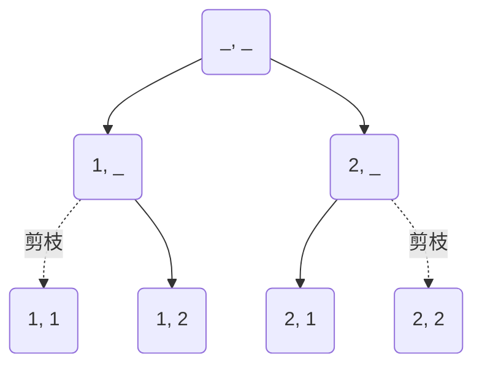
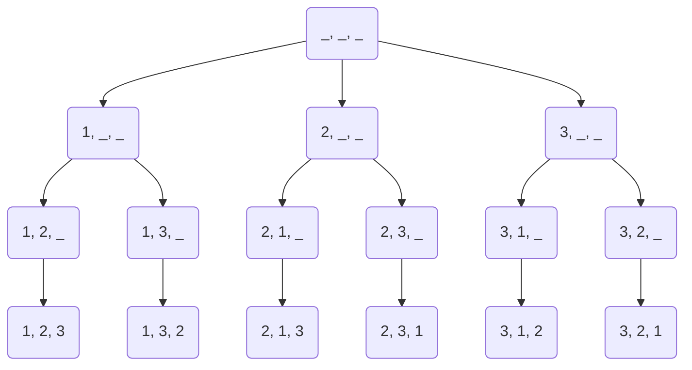

# 回溯 (Backtracking)

### 全排列 (Permutations)

```ts
[1, 2];
```

```ts
[
  [1, 2],
  [2, 1],
];
```



```ts
[1, 2, 3];
```

```ts
[
  [1, 2, 3],
  [1, 3, 2],
  [2, 1, 3],
  [2, 3, 1],
  [3, 1, 2],
  [3, 2, 1],
];
```



```ts
function permute(nums: number[]): number[][] {
  const result: number[][] = [];
  const used: boolean[] = Array(nums.length).fill(false);

  function backtrack(currentPermutation: number[]) {
    // 如果當前排列的長度等於原數組長度，說明我們已經生成了一個完整排列
    if (currentPermutation.length === nums.length) {
      result.push([...currentPermutation]);
      return;
    }

    // 走訪可用數字
    for (let i = 0; i < nums.length; i++) {
      // 如果該數字已經被選過，則跳過 (剪枝)
      if (used[i]) continue;

      // 做選擇
      currentPermutation.push(nums[i]);
      used[i] = true;

      // 遞迴進行下一步選擇
      backtrack(currentPermutation);

      // 撤銷選擇 (回溯)
      currentPermutation.pop();
      used[i] = false;
    }
  }

  backtrack([]); // 開始回溯

  return result;
}
```
