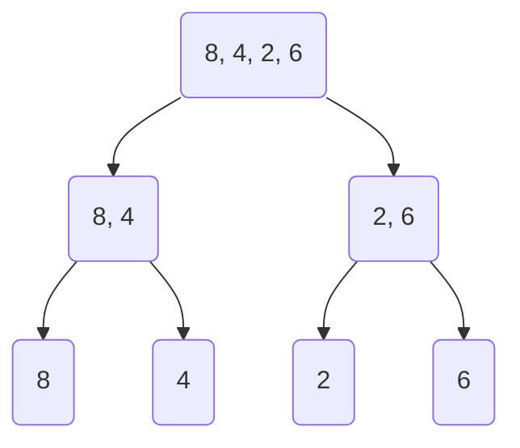
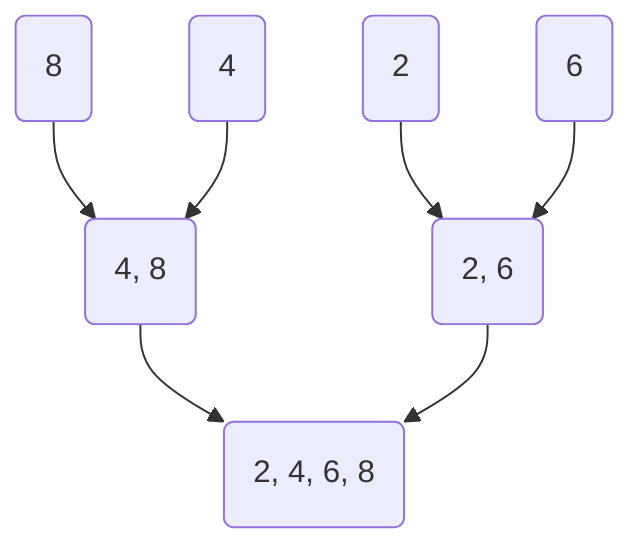

# 分治 (Divide and Conquer)

- 分 (劃分)
- 治 (合併)

```ts
[8, 4, 2, 6];
```

分：


```mermaid
flowchart TB
    0(8, 4, 2, 6)
    1(8, 4)
    2(2, 6)
    3(8)
    4(4)
    5(2)
    6(6)

    0 --> 1
    0 --> 2
    1 --> 3
    1 --> 4
    2 --> 5
    2 --> 6
```

治：


```mermaid
flowchart TB
    0(8)
    1(4)
    2(2)
    3(6)
    4(4, 8)
    5(2, 6)
    6(2, 4, 6, 8)

    0 --> 4
    1 --> 4
    2 --> 5
    3 --> 5
    4 --> 6
    5 --> 6
```
