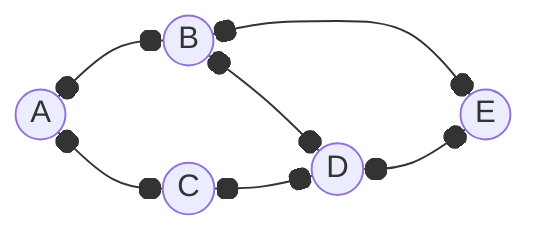

# 圖 (Graph)

## 鄰接表 - 雜湊表方式

```ts
// Graph.ts
class Graph {
  // 鄰接表
  adjacencyList: Map<string, string[]>;

  constructor(initialAdjList?: { [key: string]: string[] }) {
    this.adjacencyList = new Map();

    // 初始化
    if (initialAdjList) {
      for (const vertex in initialAdjList) {
        this.adjacencyList.set(vertex, initialAdjList[vertex]);
      }
    }
  }

  // 新增頂點
  addVertex(vertex: string): void {
    if (!this.adjacencyList.has(vertex)) {
      this.adjacencyList.set(vertex, []);
    }
  }

  // 移除頂點
  removeVertex(vertex: string): void {
    if (this.adjacencyList.has(vertex)) {
      for (const adjacentVertex of this.adjacencyList.get(vertex) || []) {
        this.removeEdge(vertex, adjacentVertex);
      }

      this.adjacencyList.delete(vertex);
    }
  }

  // 新增邊
  addEdge(vertex1: string, vertex2: string): void {
    if (this.adjacencyList.has(vertex1) && this.adjacencyList.has(vertex2)) {
      this.adjacencyList.get(vertex1)?.push(vertex2);
      this.adjacencyList.get(vertex2)?.push(vertex1);
    }
  }

  // 移除邊
  removeEdge(vertex1: string, vertex2: string): void {
    if (this.adjacencyList.has(vertex1)) {
      this.adjacencyList.set(
        vertex1,
        this.adjacencyList.get(vertex1)?.filter((v) => v !== vertex2) || [],
      );
    }

    if (this.adjacencyList.has(vertex2)) {
      this.adjacencyList.set(
        vertex2,
        this.adjacencyList.get(vertex2)?.filter((v) => v !== vertex1) || [],
      );
    }
  }

  // 印出圖的鄰接表
  print(): void {
    for (const [vertex, edges] of this.adjacencyList) {
      console.log(`${vertex} -> ${edges.join(', ')}`);
    }
  }
}
```

```ts
const graph = new Graph();

graph.addVertex('A');
graph.addVertex('B');
graph.addVertex('C');
graph.addVertex('D');
graph.addVertex('E');

graph.addEdge('A', 'B');
graph.addEdge('A', 'C');
graph.addEdge('B', 'D');
graph.addEdge('B', 'E');
graph.addEdge('C', 'D');
graph.addEdge('D', 'E');

graph.print();
// A -> B, C
// B -> A, D, E
// C -> A, D
// D -> B, C, E
// E -> B, D
```



### 初始化

```ts
const graph = new Graph({
  A: ['B', 'C'],
  B: ['A', 'D', 'E'],
  C: ['A', 'D'],
  D: ['B', 'C', 'E'],
  E: ['B', 'D'],
});
```

## 廣度優先搜尋 (Breadth-first Search)

```ts
// bfs.ts
function bfs(adjacencyList: Map<string, string[]>, startVertex: string): void {
  const queue: string[] = [startVertex]; // 使用陣列作為佇列
  const visited = new Set<string>(); // 記錄已訪問的頂點

  visited.add(startVertex); // 標記起始頂點為已訪問

  while (queue.length > 0) {
    const current = queue.shift(); // 取出佇列的第一個元素
    if (current === undefined) continue;

    console.log(current); // 當前訪問的頂點

    // 走訪所有相鄰的頂點
    for (const neighbor of adjacencyList.get(current) || []) {
      // 如果未訪問
      if (!visited.has(neighbor)) {
        visited.add(neighbor); // 標記為已訪問
        queue.push(neighbor); // 加入佇列
      }
    }
  }
}
```

```ts
// 開始廣度優先搜尋，從頂點 'A' 開始
bfs(graph.adjacencyList, 'A');
```

## 深度優先搜尋 (Depth-first Search)

```ts
function dfs(
  adjacencyList: Map<string, string[]>,
  startVertex: string,
  visited: Set<string>,
): void {
  visited.add(startVertex); // 標記該頂點已被訪問

  console.log(startVertex); // 當前訪問的頂點

  // 走訪所有相鄰的頂點
  for (const neighbor of adjacencyList.get(startVertex) || []) {
    // 如果未訪問
    if (!visited.has(neighbor)) {
      // 遞迴訪問
      dfs(adjacencyList, neighbor, visited);
    }
  }
}
```

```ts
const visited: Set<string> = new Set();

// 開始深度優先搜尋，從頂點 'A' 開始
dfs(graph.adjacencyList, 'A', visited);
```
