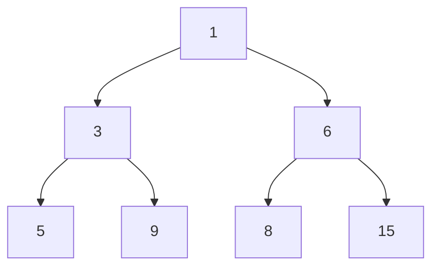
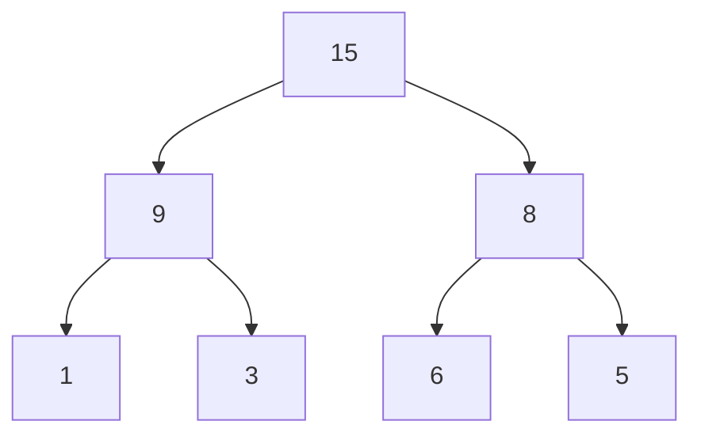

# 堆積 (Heap)

## 小頂堆積 (Min Heap)

父節點的值總是小於或等於其子節點的值。

```ts
[1, 3, 6, 5, 9, 8, 15];
```



```ts
type Comparator<T> = (a: T, b: T) => number;

class Heap<T> {
  heap: T[] = [];
  comparator: Comparator<T>;

  constructor(comparator: Comparator<T>) {
    this.comparator = comparator;
  }

  static minComparator<N>(a: N, b: N): number {
    if (a > b) return 1;
    if (a < b) return -1;
    return 0;
  }
}
```

```ts
const minHeap = new Heap<number>(Heap.minComparator);
```

## 大頂堆積 (Max Heap)

父節點的值總是大於或等於其子節點的值。

```ts
[15, 9, 8, 1, 3, 6, 5];
```



```ts
type Comparator<T> = (a: T, b: T) => number;

class Heap<T> {
  heap: T[] = [];
  comparator: Comparator<T>;

  constructor(comparator: Comparator<T>) {
    this.comparator = comparator;
  }

  static maxComparator<N>(a: N, b: N): number {
    if (b > a) return 1;
    if (b < a) return -1;
    return 0;
  }

  // 元素入堆積
  push(value: T): void {
    //
  }
}
```

```ts
const maxHeap = new Heap<number>(Heap.maxComparator);

maxHeap.push(15);
maxHeap.push(9);
maxHeap.push(8);
maxHeap.push(1);
maxHeap.push(3);
maxHeap.push(6);
maxHeap.push(5);
```
