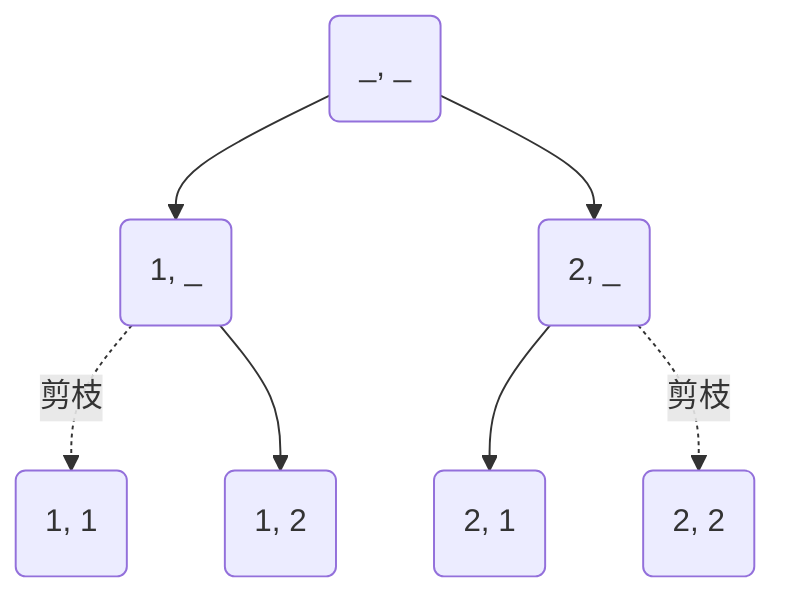

# 回溯 (Backtracking)

回溯法策略:

1. 狀態 (State): 目前的解或部分解
2. 嘗試 (Try / Choice): 針對下一步的可行選擇
3. 回退 (Backtrack): 嘗試之後，還原狀態，以便探索其他選擇
4. 紀錄解 (Record / Solution): 當達到目標條件時，保存結果
5. 剪枝 (Pruning): 提前排除不可能的路徑，提高效率

```ts
const result = [];

function backtrack(/* ... */) {
  // 紀錄解
  if (/* ... */) {
    result.push();
    return;
  }

  // 嘗試每一個可能選擇
  for (/* ... */) {
    // 剪枝
    if (/* ... */) continue;

    // 嘗試
    push();

    // 繼續探索下一個
    backtrack(/* ... */);

    // 回退
    pop();
  }
}

backtrack(/* ... */);
```

全排列:

```ts
const permutationLength = 3; // 每個排列要有幾個元素
const maxNumber = 3; // 可選數字的最大值

const current: number[] = []; // 當前狀態
const solutions: number[][] = []; // 紀錄解

function backtrack(current: number[], solutions: number[][]): void {
  // 達到目標長度，紀錄解
  if (current.length === permutationLength) {
    solutions.push([...current]);
    return;
  }

  // 嘗試每一個可能選擇
  for (let i = 1; i <= maxNumber; i++) {
    // 如果已經在 current 中，跳過 (剪枝)
    if (current.includes(i)) continue;

    // 嘗試
    current.push(i);

    // 繼續探索下一個
    backtrack(current, solutions);

    // 回退
    current.pop();
  }
}

backtrack(current, solutions);

console.log('所有解: ', solutions);
// 所有解: [[1, 2, 3], [1, 3, 2], [2, 1, 3], [2, 3, 1], [3, 1, 2], [3, 2, 1]]
```

問題：給定一個不同數字的候選陣列 `candidates` 和一個整數目標 `target`，根據候選陣列內的值加總等於整數目標的所有唯一組合的排列。

```ts
const candidates = [2, 3, 6, 7];
const target = 7;
```

```
2 + 2 + 3 = 7
7 = 7
```

使用當前和：不能提早預判是否超過目標，必須先累加到「當前和」後再進行比較，少了剪枝的機會。

<details>
  <summary>使用當前和</summary>

```ts
function combinationSum(candidates: number[], target: number): number[][] {
  const result: number[][] = [];

  function backtrack(sum: number, combination: number[], start: number): void {
    // 如果當前的和等於目標值，表示找到了一個有效組合
    if (sum === target) {
      result.push([...combination]);
      return;
    }

    // 如果當前和超過目標值，則返回
    if (sum > target) return;

    // 走訪候選數字
    for (let i = start; i < candidates.length; i++) {
      // 加入當前候選數字到組合中
      combination.push(candidates[i]);

      // 繼續遞迴探索，注意這裡還是傳遞 i，因為同一個數字可以被重複使用
      backtrack(sum + candidates[i], combination, i);

      // 回退，移除當前加入的數字 (回溯)
      combination.pop();
    }
  }

  // 初始呼叫 backtrack，從 0 開始累加
  backtrack(0, [], 0);

  return result;
}
```

</details>

使用剩餘值：能夠提早根據「剩餘的目標值」來決定是否可以剪枝。

- 用減法減到剩餘 0
- 當前候選值 > 當前剩餘數，進行剪枝

```
7                         // []
7 - 2 = 5                 // [2]
        5 - 2 = 3         // [2, 2]
                3 - 2 = 1 // [2, 2, 2]
                3 - 3 = 0 // [2, 2, 3]，紀錄解
```

```ts
function combinationSum(candidates: number[], target: number): number[][] {
  const result: number[][] = [];

  function backtrack(/* ... */) {
    // ...
  }

  backtrack(/* ... */);

  return result;
}
```

狀態：

- `remaining`：當前剩餘值
- `combination`：當前有效組合
- `index`：當前索引

```ts
function backtrack(remaining: number, combination: number[], index: number) {
  // ...
}

backtrack(target, [], 0);
```

當減至 0 時為解，紀錄解

```ts
if (remaining === 0) {
  result.push([...combination]);
  return;
}
```

當當前的候選值 > 當前剩餘數時，進行剪枝

```ts
// 走訪所有候選值
for (let i = start; i < candidates.length; i++) {
  if (candidates[i] > remaining) continue;

  // ...
}
```

嘗試

```ts
combination.push(candidates[i]);
```

遞迴繼續探索

```ts
backtrack(remaining - candidates[i], combination, i);
```

回退

```ts
combination.pop();
```

### 全排列 (Permutations)

```ts
[1, 2];
```

```ts
[
  [1, 2],
  [2, 1],
];
```



```ts
function permute(nums: number[]): number[][] {
  const result: number[][] = [];
  const selected: boolean[] = Array(nums.length).fill(false);

  function backtrack(currentPermutation: number[]) {
    // 如果當前排列長度等於原陣列長度，說明我們已經生成了一個完整排列
    if (currentPermutation.length === nums.length) {
      result.push([...currentPermutation]);
      return;
    }

    // 走訪可用數字
    for (let i = 0; i < nums.length; i++) {
      // 如果該數字已經被選過，則跳過 (剪枝)
      if (selected[i]) continue;

      // 做選擇
      currentPermutation.push(nums[i]);
      selected[i] = true;

      // 遞迴進行下一步選擇
      backtrack(currentPermutation);

      // 撤銷選擇 (回溯)
      currentPermutation.pop();
      selected[i] = false;
    }
  }

  backtrack([]); // 開始回溯

  return result;
}
```
