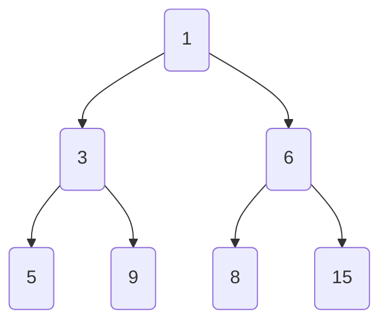
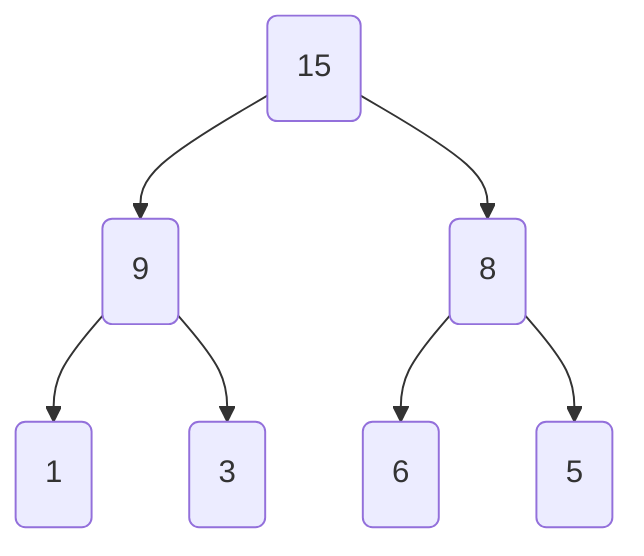

# 堆積 (Heap)

https://jsr.io/@std/data-structures/doc/~/BinaryHeap

```ts
import { BinaryHeap, ascend, descend } from '@std/data-structures';
```

## 小頂堆積 (Min Heap)

父節點的值總是小於或等於其子節點的值。

```ts
[1, 3, 6, 5, 9, 8, 15];
```



```ts
import { BinaryHeap, ascend } from '@std/data-structures';

const minHeap = new BinaryHeap<number>(ascend);

// 元素入堆積
minHeap.push(1, 3, 6, 5, 9, 8, 15);

// 取得堆積頂元素
console.log(minHeap.peek()); // 1

// 頂元素出堆積
console.log(minHeap.pop()); // 1
console.log(minHeap.pop()); // 3
console.log(minHeap.pop()); // 5

// 取得堆積長度
console.log(minHeap.length); // 4

// 判斷堆積是否為空
console.log(minHeap.isEmpty()); // false
```

## 大頂堆積 (Max Heap)

父節點的值總是大於或等於其子節點的值。

```ts
[15, 9, 8, 1, 3, 6, 5];
```



```ts
import { BinaryHeap, descend } from '@std/data-structures';

const maxHeap = new BinaryHeap<number>(descend);

// 元素入堆積
maxHeap.push(1, 3, 6, 5, 9, 8, 15);

// 取得堆積頂元素
console.log(maxHeap.peek()); // 15

// 頂元素出堆積
console.log(maxHeap.pop()); // 15
console.log(maxHeap.pop()); // 9
console.log(maxHeap.pop()); // 8

// 取得堆積長度
console.log(maxHeap.length); // 4

// 判斷堆積是否為空
console.log(maxHeap.isEmpty()); // false
```
