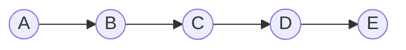
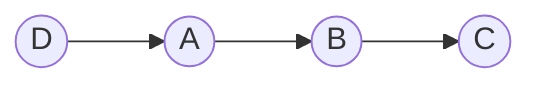
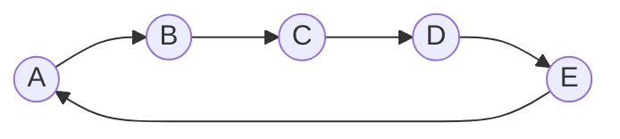
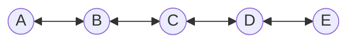

# 鏈結串列 (Linked List)

## 單向鏈結串列 (Singly Linked List)

```ts
class ListNode<T> {
  value: T;
  next: ListNode<T> | null;

  constructor(value: T, next: ListNode<T> | null = null) {
    this.value = value;
    this.next = next;
  }
}
```

```ts
const A = new ListNode('A');
const B = new ListNode('B');
const C = new ListNode('C');
const D = new ListNode('D');
const E = new ListNode('E');

A.next = B;
B.next = C;
C.next = D;
D.next = E;

const values: string[] = [];

let current: ListNode<string> | null = A;

while (current !== null) {
  values.push(current.value);
  current = current.next;
}

console.log(values.join(' -> '));
// A -> B -> C -> D -> E
```



定義鏈結串列類別：

```ts
class LinkedList<T> {
  head: ListNode<T> | null;

  constructor() {
    this.head = null;
  }

  // 新增節點到鏈結串列的尾端
  append(value: T): void {
    const newNode = new ListNode(value);

    if (this.head === null) {
      // 如果鏈結串列為空，則將新節點設為頭節點
      this.head = newNode;
    } else {
      let current = this.head;

      while (current.next !== null) {
        current = current.next;
      }

      current.next = newNode;
    }
  }

  // 將節點插入到鏈結串列的開頭
  prepend(value: T): void {
    const newNode = new ListNode(value);
    newNode.next = this.head;
    this.head = newNode;
  }

  // 印出鏈結串列中的所有值
  print(): void {
    let current = this.head;
    const values: T[] = [];

    while (current !== null) {
      values.push(current.value);
      current = current.next;
    }

    console.log(values.join(' -> '));
  }
}
```

```ts
const linkedList = new LinkedList<string>();

linkedList.append('A');
linkedList.append('B');
linkedList.append('C');
linkedList.prepend('D');

linkedList.print();
// D -> A -> B -> C
```



## 環狀鏈結串列 (Circular Linked List)

```ts
class CircularLinkedList<T> {
  head: ListNode<T> | null;

  constructor() {
    this.head = null;
  }

  // 在尾端新增節點並形成環狀鏈結串列
  append(value: T): void {
    const newNode = new ListNode(value);

    if (this.head === null) {
      // 如果是第一個節點，將其設為頭節點，並指向自己
      this.head = newNode;
      newNode.next = this.head; // 環狀結構
    } else {
      let current = this.head;

      // 找到最後一個節點（指向頭節點的節點）
      while (current.next !== null && current.next !== this.head) {
        current = current.next;
      }

      current.next = newNode;
      newNode.next = this.head; // 使其成為環狀結構
    }
  }

  // 印出環狀鏈結串列
  print(): void {
    if (this.head === null) return;

    let current = this.head;
    const values: T[] = [];

    do {
      values.push(current.value);
      current = current.next! as ListNode<T>;
    } while (current !== this.head);

    console.log(`${values.join(' -> ')} -> (回到頭)`);
  }
}
```



## 雙向鏈結串列 (Doubly Linked List)


