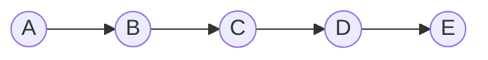
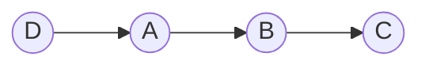
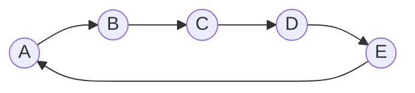
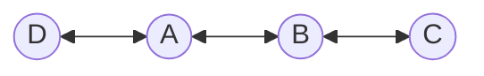

# 鏈結串列 (Linked List)

## 單向鏈結串列 (Singly Linked List)

- [`ListNode.ts`](./ListNode.ts)
- [`LinkedList.ts`](./LinkedList.ts)

```ts
class ListNode<T> {
  value: T;
  next: ListNode<T> | null;

  constructor(value: T, next: ListNode<T> | null = null) {
    this.value = value;
    this.next = next;
  }
}
```

```ts
const A = new ListNode('A');
const B = new ListNode('B');
const C = new ListNode('C');
const D = new ListNode('D');
const E = new ListNode('E');

A.next = B;
B.next = C;
C.next = D;
D.next = E;

const values: string[] = [];

let current: ListNode<string> | null = A;

while (current !== null) {
  values.push(current.value);
  current = current.next;
}

console.log(values.join(' -> '));
// A -> B -> C -> D -> E
```



定義鏈結串列類別：

```ts
class LinkedList<T> {
  head: ListNode<T> | null;

  constructor() {
    this.head = null;
  }

  // 新增節點到鏈結串列的尾部
  append(value: T): void {
    const newNode = new ListNode(value);

    if (this.head === null) {
      // 如果鏈結串列為空，則將新節點設為頭節點
      this.head = newNode;
    } else {
      let current = this.head;

      while (current.next !== null) {
        current = current.next;
      }

      current.next = newNode;
    }
  }

  // 新增節點到鏈結串列的頭部
  prepend(value: T): void {
    const newNode = new ListNode(value);
    newNode.next = this.head;
    this.head = newNode;
  }

  // 印出鏈結串列
  print(): void {
    let current = this.head;
    const values: T[] = [];

    while (current !== null) {
      values.push(current.value);
      current = current.next;
    }

    console.log(values.join(' -> '));
  }
}
```

```ts
const linkedList = new LinkedList<string>();

linkedList.append('A');
linkedList.append('B');
linkedList.append('C');
linkedList.prepend('D');

linkedList.print();
// D -> A -> B -> C
```



刪除節點：

`remove(value: T): void`

尋找節點：

`find(value: T): void`

## 環狀鏈結串列 (Circular Linked List)

- [`ListNode.ts`](./ListNode.ts)
- [`CircularLinkedList.ts`](./CircularLinkedList.ts)

```ts
class CircularLinkedList<T> {
  head: ListNode<T> | null;

  constructor() {
    this.head = null;
  }

  // 在尾端新增節點並形成環狀鏈結串列
  append(value: T): void {
    const newNode = new ListNode(value);

    if (this.head === null) {
      // 如果是第一個節點，將其設為頭節點，並指向自己
      this.head = newNode;
      newNode.next = this.head; // 環狀結構
    } else {
      let current = this.head;

      // 找到最後一個節點（指向頭節點的節點）
      while (current.next !== null && current.next !== this.head) {
        current = current.next;
      }

      current.next = newNode;
      newNode.next = this.head; // 使其成為環狀結構
    }
  }

  // 印出環狀鏈結串列
  print(): void {
    if (this.head === null) return;

    let current = this.head;
    const values: T[] = [];

    do {
      values.push(current.value);
      current = current.next as ListNode<T>;
    } while (current !== this.head);

    console.log(`${values.join(' -> ')} -> (回到頭)`);
  }
}
```



## 雙向鏈結串列 (Doubly Linked List)

- [`DoublyListNode.ts`](./DoublyListNode.ts)
- [`DoublyLinkedList.ts`](./DoublyLinkedList.ts)

```ts
class DoublyListNode<T> {
  value: T;
  next: DoublyListNode<T> | null;
  prev: DoublyListNode<T> | null;

  constructor(
    value: T,
    next: DoublyListNode<T> | null = null,
    prev: DoublyListNode<T> | null = null,
  ) {
    this.value = value;
    this.next = next;
    this.prev = prev;
  }
}
```

```ts
class DoublyLinkedList<T> {
  head: DoublyListNode<T> | null;
  tail: DoublyListNode<T> | null;

  constructor() {
    this.head = null;
    this.tail = null;
  }

  // 新增節點到鏈結串列的尾部
  append(value: T): void {
    const newNode = new DoublyListNode(value);

    if (!this.tail) {
      // 如果鏈結串列是空的
      this.head = newNode;
      this.tail = newNode;
    } else {
      // 更新 tail 節點
      newNode.prev = this.tail;
      this.tail.next = newNode;
      this.tail = newNode;
    }
  }

  // 新增節點到鏈結串列的頭部
  prepend(value: T): void {
    const newNode = new DoublyListNode(value);

    if (!this.head) {
      // 如果鏈結串列是空的
      this.head = newNode;
      this.tail = newNode;
    } else {
      // 更新 head 節點
      newNode.next = this.head;
      this.head.prev = newNode;
      this.head = newNode;
    }
  }

  // 印出雙向鏈結串列
  print(): void {
    let current = this.head;

    const values: T[] = [];

    while (current) {
      values.push(current.value);
      current = current.next;
    }

    console.log(values.join(' <-> '));
  }
}
```

```ts
const doublyLinkedList = new DoublyLinkedList<string>();

doublyLinkedList.append('A');
doublyLinkedList.append('B');
doublyLinkedList.append('C');
doublyLinkedList.prepend('D');

doublyLinkedList.print();
// D <-> A <-> B <-> C
```



## 雙指標 (Two Pointers)

相關名詞：

- 弗洛伊德判圈演算法 (Floyd’s Cycle Detection Algorithm)
- 龜兔賽跑演算法 (Tortoise and Hare Algorithm)
- 快慢指標 (Fast and Slow Pointers)

問題：找出鏈結串列的中間節點。

慢指標每次移動一步，快指標每次移動兩步：

```ts
let slow: ListNode<T> | null = head;
let fast: ListNode<T> | null = head;

while (fast !== null && fast.next !== null) {
  slow = slow.next;
  fast = fast.next.next;
}
```

初始狀態：

```ts
slow
 ↓
 1 -> 2 -> 3 -> 4 -> 5
 ↑
fast
```

第一輪迴圈：

```ts
     slow
      ↓
 1 -> 2 -> 3 -> 4 -> 5
           ↑
          fast
```

第二輪迴圈：

```ts
          slow
           ↓
 1 -> 2 -> 3 -> 4 -> 5
                     ↑
                    fast
```

迴圈結束：

- 慢指標 `slow` 在節點 3
- 快指標 `fast` 在節點 5

此時慢指標 `slow` 為該鏈結串列的中間節點。
