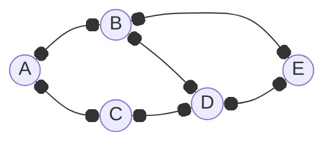

# 圖 (Graph)

```ts
const graph = new Graph();

graph.addVertex('A');
graph.addVertex('B');
graph.addVertex('C');
graph.addVertex('D');
graph.addVertex('E');

graph.addEdge('A', 'B');
graph.addEdge('A', 'C');
graph.addEdge('B', 'D');
graph.addEdge('B', 'E');
graph.addEdge('C', 'D');
graph.addEdge('D', 'E');

graph.print();
// A -> B, C
// B -> A, D, E
// C -> A, D
// D -> B, C, E
// E -> B, D
```


